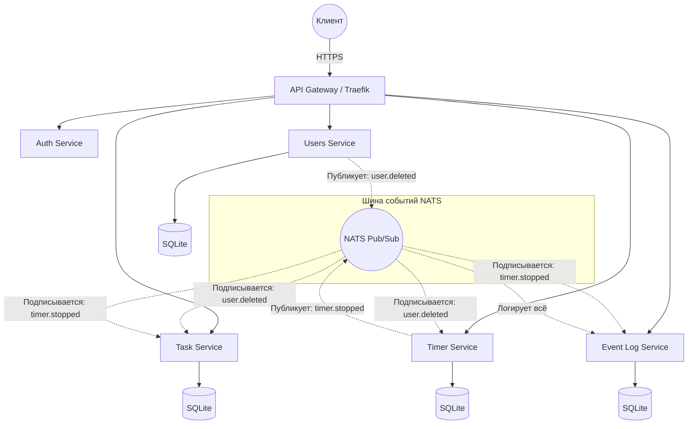

# Distributed Task Management System (DTMS)

## 1. Описание проекта

**DTMS** — это высоконагруженная микросервисная экосистема для управления задачами, трекинга времени и аудита событий. Система строится на принципах Event-Driven архитектуры, обеспечивая слабую связанность сервисов и возможность горизонтального масштабирования.

### Основные компоненты:

* **API Gateway:** Единая точка входа, маршрутизация и проверка JWT.
* **Users Service:** Управление аккаунтами и профилями.
* **Auth Service:** Выдача, валидация и отзыв JWT-токенов.
* **Task Service:** CRUD иерархических (древовидных) задач.
* **Timer Service:** Управление активными сессиями отсчета времени.
* **Event Log Service:** Система аудита и сбора статистики.

## 2. Архитектура

Система работает на базе **Rust** (Axum + SQLx + SQLite) с использованием **NATS** как шины событий для асинхронного взаимодействия.

### 1. Users Service

*Управление пользователями.*

* **Модель:** `User { id: UUID, email: String, password_hash: String, is_deleted: bool }`
* **API:**
* `POST /users/register` — создание профиля.
* `GET /users/me` — получение данных текущего пользователя.
* `DELETE /users/me` — удаление профиля.

* **События:**
* `user.created` (payload: `{ user_id }`)
* `user.deleted` (payload: `{ user_id }`)

### 2. Auth Service

*Безопасность и сессии.*

* **Модель:** `Session { user_id: UUID, token: String, expires_at: DateTime }`
* **API:**
* `POST /auth/login` — аутентификация, выдача JWT.
* `POST /auth/refresh` — обновление токена.
* `POST /auth/logout` — отзыв текущей сессии.

* **События:**
* `auth.logged_in` (payload: `{ user_id }`)
* `auth.logged_out` (payload: `{ user_id }`)

### 3. Task Service

*Древовидные задачи.*

* **Модель:** `Task { id: UUID, user_id: UUID, parent_id: Option<UUID>, title: String, description: String, status: String, estimated_mins: i32, spent_mins: i32 }`
* **API:**
* `POST /tasks` — создание задачи.
* `GET /tasks?parent_id=...` — получение списка.
* `GET /tasks/{id}/tree` — получение всего поддерева.
* `PATCH /tasks/{id}` — обновление данных.
* `DELETE /tasks/{id}` — удаление задачи.

* **События:**
* `task.created` (payload: `{ task_id, user_id }`)
* `task.updated` (payload: `{ task_id, changes }`)
* `task.deleted` (payload: `{ task_id }`)

### 4. Timer Service

*Трекинг времени.*

* **Модель:** `TimerSession { id: UUID, task_id: UUID, user_id: UUID, start_time: DateTime, end_time: Option<DateTime> }`
* **API:**
* `POST /timer/start` — начало отсчета для задачи.
* `POST /timer/stop` — завершение отсчета.
* `GET /timer/active` — проверка запущенных таймеров пользователя.

* **События:**
* `timer.started` (payload: `{ timer_id, task_id, user_id }`)
* `timer.stopped` (payload: `{ timer_id, task_id, duration_seconds }`)

### 5. Event Log Service

*Аудит.*

* **Модель:** `Log { id: UUID, event_name: String, payload: JSON, timestamp: DateTime }`
* **API:**
* `GET /logs` — история событий с фильтрами.
* `GET /logs/stats/{task_id}` — сумма времени из событий `timer.stopped`.

* **События:**
* *Слушает все события (`*.*`) и сохраняет их в БД.*

### Общая схема потока событий

Теперь у нас есть полная таблица для реализации. Я предлагаю начать с **Users Service**. Поскольку мы пишем это на **Rust**, я подготовлю структуру для одного файла, который включает:

1. Описание `struct` для моделей данных.
2. Роуты `Axum`.
3. Подключение `utoipa` для генерации OpenAPI.
4. Логику подключения к NATS для отправки события `user.deleted`.

## 3. План разработки (Epic Tasks)

### Epic 1: Базовая инфраструктура и API Gateway

* Настройка Docker Compose для всех сервисов.
* Конфигурация API Gateway (Traefik).
* Настройка общего брокера событий (NATS) и единого протокола взаимодействия.

### Epic 2: Core Services (Users & Auth)

* Реализация `Users Service`: регистрация, профиль, Soft/Hard Delete.
* Реализация `Auth Service`: логика выдачи/валидации JWT.
* Настройка Middleware в Gateway для проверки токенов.

### Epic 3: Task Management Service

* Реализация иерархической модели данных (Adjacency List).
* CRUD методы для задач.
* Интеграция с OpenAPI (Utoipa).
* Подписка на событие `UserDeleted` для каскадной очистки.

### Epic 4: Timer Service

* Реализация логики Start/Stop сессий.
* Публикация событий `TimerStopped` в брокер.
* Встроенный OpenAPI для управления таймерами.

### Epic 5: Event Log Service

* Реализация подписчика на все основные события системы.
* Хранение логов в SQLite.
* API для получения истории событий и статистики по задачам.

## 4. Требования к реализации каждого сервиса

Каждый микросервис **обязан** соответствовать следующим критериям:

1. **OpenAPI:** Автоматическая генерация Swagger-документации по адресу `/swagger-ui/`.
2. **Health Check:** Эндпоинт `/health` для Docker-мониторинга.
3. **Логирование:** Использование стандартного логирования Rust.
4. **Config:** Конфигурация через переменные окружения (`dotenv`).

### Как пользоваться этим документом:

Для каждой **Epic Task** создавайте тикеты/задачи в вашем трекере, разбивая их на:

1. **Scaffolding:** Создание проекта Rust, подключение библиотек.
2. **DB Schema:** Определение миграций (SQLx).
3. **API Implementation:** Реализация эндпоинтов.
4. **Integration:** Настройка общения с брокером сообщений (NATS).
5. **Docs:** Проверка генерации OpenAPI.
